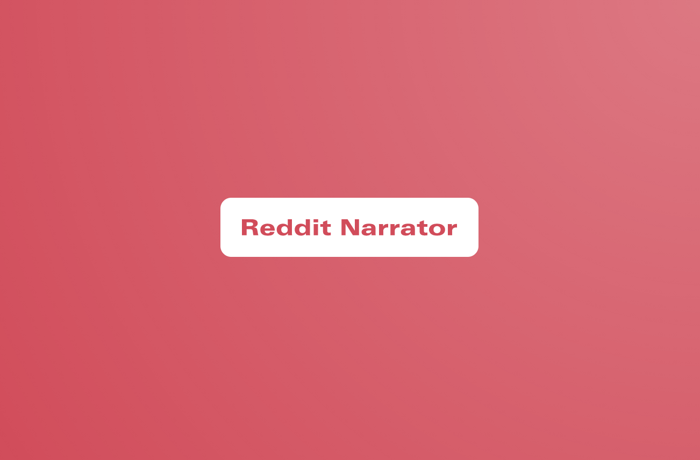

 

## **Motivation:**
A while back, I came across a couple of 'Ask Reddit' videos where people took screenshots of interesting questions and replies on the 'Ask Reddit' subreddit. 

Just as a fun challenge, I wanted to try to automate these videos.

## **Results:**
Co-created a Youtube channel with the results of the scripts:
https://www.youtube.com/channel/UCVFG7fbuz3noaXS56ZR3cxg/videos

## **Tools Used:**
* Selenium
* MoviePy
* Pyttsx

## **Skills Used:**
* Selenium
* MoviePy
* Pyttsx

## **Process:**
1) I created a baseline script using Selenium, moviepy, and pyttsx.
2) To save time, I hired a freelancer to add feature functionality such as the partial screenshots.
3) Hired a Youtube SEO optimization expert, created a Youtube advertising campaign, and coordinated with a Youtube marketing specialist to try and increase channel visibility.

## **Possible Next Steps:**
* Blur/censor swear words
* Automate thumbnails
* Create a cron job to automate running the script every day
* Adjust text that's too big to fit on a single screen

* Disclaimer - Parts of the project may have been omitted/ obfuscated to make it challenging to simply copy and use. If you would like to monetize this, send me a message and we can talk!